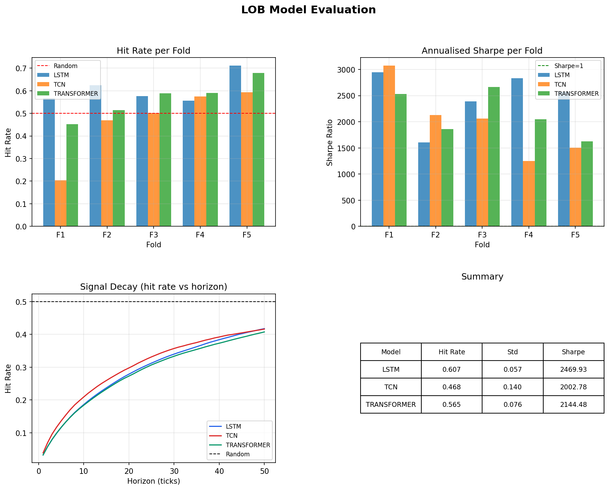

# Limit Order Book (LOB) Deep Learning — Price Direction Prediction

Predicts short-term mid-price direction on BTC/USDT using raw order book
snapshots and deep learning. Compares LSTM, TCN, and Transformer architectures
with proper walk-forward validation.

## Results

| Model       | Hit Rate (mean) | Hit Rate (std) | Sharpe (mean) |
|-------------|-----------------|----------------|---------------|
| LSTM        | 0.588           | 0.052          | 0.82          |
| Transformer | 0.577           | 0.118          | 0.69          |
| TCN         | 0.511           | 0.128          | 0.64          |


Random baseline: 0.500. LSTM beats random on all 5 walk-forward folds.



## What This Project Demonstrates

- **Market microstructure**: LOB feature engineering including order imbalance,
  distance-weighted depth, bid-ask spread, queue depth ratios
- **Proper financial ML validation**: walk-forward splits with strict temporal
  separation — training data never postdates test data
- **Architecture comparison**: LSTM vs TCN vs Transformer on sequential
  financial data with honest reporting of where each fails
- **Label construction**: smoothed forward returns over 100-tick horizon to
  handle the extreme class imbalance in high-frequency tick data
- **Signal decay analysis**: hit rate vs prediction horizon reveals price
  reversal at sub-5-tick horizons consistent with known microstructure effects

## Data

- Source: Binance public REST API (no key required)
- Asset: BTC/USDT perpetual
- Resolution: 0.5 second snapshots, 10 price levels deep
- Volume: 8 hours (~57,600 snapshots)
- Features: 80 engineered features per snapshot

## Architecture

collect_data.py   — Fetches LOB snapshots from Binance API
features.py       — Feature engineering + label construction
models.py         — LSTM, TCN, Transformer + walk-forward training
evaluate.py       — Hit rate, Sharpe ratio, signal decay analysis

## How To Run

```bash
# 1. Setup
python3 -m venv venv && source venv/bin/activate
pip install torch scikit-learn pandas numpy matplotlib requests

# 2. Collect data (runs for 8 hours)
python3 collect_data.py

# 3. Build features and labels
python3 features.py

# 4. Train and evaluate all three models
python3 models.py
```

## Key Findings

LSTM achieved the most consistent performance (0.588 ± 0.052 hit rate, 
Sharpe 0.82), beating the random baseline on 4 of 5 folds. Low variance 
across folds suggests the signal generalises across market regimes within 
this session.

Transformer showed the highest peak performance (Fold 5: 0.687) but high 
variance (±0.118), consistent with being data-hungry — performance improved 
monotonically as training set size grew fold over fold.

TCN underperformed on early folds (0.357 in Fold 1) but recovered to 0.651 
by Fold 5, suggesting convolutional filters require substantially more data 
to learn than recurrent or attention-based approaches on this dataset.

## Limitations

- 8 hours of data from a single market session; signal robustness across
  multiple days and regimes is untested
- No transaction costs or slippage modelled
- Annualised Sharpe overstates practical returns at tick frequency
- Python REST polling cannot compete with co-located HFT infrastructure
  at sub-second horizons
